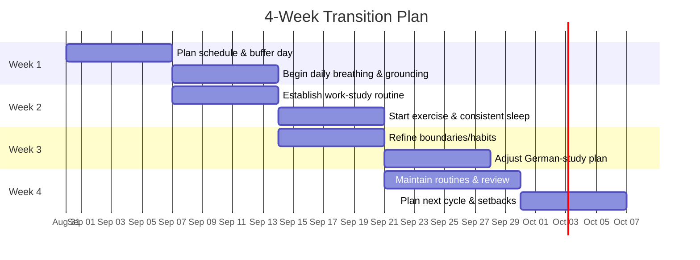

# Do-you-often-feel-stressed-
Some Research Materials on Stress

I often feel stressed about achieving my goals in life, and I sometimes struggle with anxiety. This time, I noticed that I felt stressed even after having a wonderful vacation in Mallorca, despite the fact that I’m currently not employed.

So, I decided to gather some information about why this might happen and how to better deal with this kind of stress.

The information below is based on my conversation with ChatGPT and is mainly intended for sharing my personal experience and what I found helpful.

## Please note: If you are experiencing serious or persistent problems, please contact a qualified healthcare professional.

# Executive Summary  
Feeling stressed or low after a vacation (often called **post-vacation blues** or **transition stress**) is a common, short-lived reaction when returning to routine duties.  Even after a pleasant break, brain chemistry (e.g. dopamine levels) and psychological factors reset to baseline, making normal life feel unexpectedly taxing.  Concepts like **hedonic adaptation** explain this: we quickly adapt to good experiences and return to a “set point” of mood.  Other factors – such as **anticipatory anxiety** about upcoming tasks, **decision fatigue** from looming choices, or **perfectionism** – can amplify stress on return.  Though not a clinical disorder, this reaction can be intense for days or a few weeks, typically easing as you readjust.  

Short-term coping (e.g. deep breathing, grounding, brief CBT/ACT exercises) can quickly reduce acute anxiety.  Establishing a gentle routine (daily planning, micro-goals, exercise, good sleep) helps regain control.  Long-term, building healthy habits and boundaries (e.g. regular exercise, scheduled breaks, manageable workloads) and, if needed, professional support (CBT, mindfulness training) build resilience.  Below we define key terms, review causes and prevalence, and present evidence-based strategies.  We then give practical schedules (balancing work and German study), comparison tables of techniques, a prioritized action plan, and a 4-week implementation timeline (Mermaid Gantt).

## Definitions & Concepts  
- **Post-vacation blues (post-holiday stress):** A non-clinical term for low mood or irritability after returning from a break.  People report sadness, anxiety or fatigue despite “objectively fine” circumstances.  It’s often short-lived (days to weeks) and is *not* the same as major depression.  Other names include *post-vacation depression* or *vacation fade-out*.  
- **Transition stress:** Stress triggered by sudden shifts in environment or routine (e.g. “returning to routine after a vacation”).  During vacation the mind resets (more leisure, less pressure); abruptly resuming work can feel jarring.  Symptoms (low mood, irritability, overwhelm) are a normal *adjustment response*, not personal failure.  
- **Adjustment disorder:** A clinical diagnosis for an excessive reaction to life changes.  It can be triggered by either positive or negative events (e.g. starting a new job, retirement, or even a fun event).  Symptoms (anxiety, sadness, physical complaints) typically begin within 3 months of the change and improve within 6 months once adjusted.  Post-vacation stress often falls short of this severity, but an *Adjustment Disorder* is formally diagnosed when stress is intense or long-lasting.  (Note: we assume no clinical diagnosis unless specified.)  
- **Anticipatory anxiety:** Worry about upcoming tasks/events. It is “the anxiety we feel when we are anticipating a difficult decision, action or situation”.  Essentially, it’s fear of something that *might* happen (like the dread of Monday tasks).  Anticipatory anxiety can trigger stress long before work resumes and fuel avoidance.  
- **Decision fatigue:** Cognitive exhaustion from making many choices. Successive decision-making reduces one’s ability to make high-quality decisions.  After a relaxing break, the sudden barrage of decisions (what email to answer first, scheduling, etc.) can overwhelm.  As one review notes, decision fatigue “refers to the deteriorating quality of decisions” after prolonged decision-making, caused by exhaustion of mental resources.  
- **Perfectionism:** A personality trait of setting **unrealistically high standards** for oneself.  While a bit of high standards can motivate, perfectionism is often driven by fear of failure and self-criticism.  In practice, a perfectionist may push too hard on returning to work (e.g. “I must catch up on everything immediately”), which can spike stress and anxiety.  Indeed, perfectionism and anxiety often form a feedback loop.  
- **Hedonic adaptation:** The phenomenon of quickly returning to a baseline level of happiness after a change.  For example, you enjoy a vacation (happiness spikes) but once home, brain chemistry and expectations normalize and that heightened mood fades.  This is why even good events can be followed by a relative let-down.  

## Prevalence and Typical Duration  
Post-vacation stress is very common.  One survey found **34% of people often** feel “melancholy” after a trip, and **20% always** feel down when it ends.  In other words, well over half of vacationers report some blues.  In Spain, surveys suggest 35–75% of workers experience post-vacation “syndrome”.  (Research designs vary, but the takeaway is that many people feel a slump for a short time.)  

Typically, symptoms peak in the first days back.  For instance, 43% of people in the TripAdvisor poll felt stressed within a **week** of returning, and 19% as early as the **first day**.  Most people recover within days or a couple of weeks once routines resume.  (By contrast, an *Adjustment Disorder* persists or worsens beyond 6 months.)  Clearly, the exact duration varies with context and individual factors, but in most cases the distress is **temporary**.

## Risk and Protective Factors  
**Risk factors** for strong post-event stress include: high baseline stress or a stressful job; unrealistic expectations (perfectionism); a tightly-packed trip (little rest on vacation); significant life dissatisfaction; lack of social support at home; poor sleep or health habits; and abrupt transitions with no “buffer” (e.g. flying home the night before returning to work).  A survey noted that people whose jobs are highly stressful have worse post-vacation moods, whereas those with low-stress jobs bounce back faster.  Underlying anxiety or depression also worsen this reaction: if you rely on a distraction (vacation) to lift a depressive mood, its end can feel especially stark.  

**Protective factors** include: a genuinely restful vacation (low-stress activities); building in buffer days (e.g. a travel buffer day off before work); having enjoyable things to look forward to (thus smoothing the descent); good coping skills (like mindfulness or CBT habits); physical health (regular exercise and sleep); and a gradual return to routine (ease back in rather than an abrupt start).  Strong social support (talking with friends/family about how you feel) also helps normalize the experience.  

## Mechanisms: Neurobiology and Cognitive Patterns  
Several interacting mechanisms explain why a positive experience can be followed by stress:

- **Neurochemical reset:** Anticipation and enjoyment of vacation raise “reward” neurotransmitters like dopamine.  When the vacation ends, those levels drop back to normal, which can leave you feeling subdued or even a bit down.  In other words, the brain’s reward system has adjusted, and the return to routine feels comparatively unrewarding.  (This is part of hedonic adaptation.)  Likewise, the stress hormone cortisol decreases during time off; coming back to deadlines revs up the HPA axis and cortisol again, triggering anxiety.  

- **Cognitive contrast and processing:** On vacation your mind learned to expect leisure and low demands; suddenly facing emails and schedules creates cognitive dissonance.  Thoughts like “Everyone else is back to normal and here I am anxious” or catastrophizing (“If I don’t clear all this inbox, I’ll fail”) amplify stress.  Perfectionistic thinking (all-or-nothing goals) and fear of failure fuel this.  Also, *decision fatigue* (the need to make many rapid choices on return) can overwhelm one’s mental bandwidth.  Forming new daily plans and prioritizing is itself a cognitive load when tired from travel.  

- **Behavioral cycles:** After vacation people often neglect prior routines (sleep schedules, exercise, diet). Poor sleep and inactivity further dysregulate mood and stress resilience.  Additionally, procrastination or avoidance can set in: dreading tasks, one may delay them, which piles on pressure.  

From a psychological view, these responses are **normal adjustments**.  As one counselor notes, “the brain adapts quickly to reduced pressure…re-engaging with structure and obligation requires adjustment — not failure or weakness”.  Understanding that this slump is temporary and physiologically expected is itself coping.  

## Immediate Coping Techniques (Evidence-Based)  
When stress flares up, these **brief, evidence-based interventions** can provide quick relief:

- **Deep breathing exercises:**  Five minutes of *controlled breathing* (e.g. inhaling deeply through the nose, then exhaling slowly) significantly reduces anxiety.  Stanford research showed that a daily 5-minute “cyclic sighing” exercise (take two deep breaths in, then long exhale) lowered participants’ anxiety and improved mood.  (Long exhalations activate the parasympathetic “rest-and-digest” system.)  Other methods like 4-7-8 breathing or box breathing work similarly.  **Time:** ~5 minutes. **Evidence:** Strong (RCTs show anxiety reduction). **Suitability:** Acute stress, anywhere, anytime.

- **Grounding techniques:**  Grounding brings attention to the present and can “reset” an anxious mind.  For example, the *5-4-3-2-1* technique (name 5 things you see, 4 you feel, 3 you hear, 2 you smell, 1 you taste) or the *3-3-3* (look around for 3 colors, listen for 3 sounds, move 3 parts of your body) immediately shift focus outward.  The Cleveland Clinic notes grounding can “reduce stress hormones and calm your body and mind”.  (E.g. visualizing a calm place or repeating simple facts/counting also helps.)  **Time:** Minutes. **Evidence:** Moderate (common in mindfulness/CBT; physiological rationale). **Suitability:** When feeling panicky or scattered at work or home.

- **Brief CBT exercise (“thought reframing”):**  Challenge anxiety-provoking thoughts.  For instance, if you think “I’ll never finish everything,” pause and reframe: “I can only do so much; I’ll tackle high-priority tasks first.”  Writing down worries and then writing a balanced response is a fast CBT skill.  The NHS highlights that CBT helps manage anxiety by changing thought patterns.  **Time:** ~5–10 minutes per worry. **Evidence:** Strong (CBT is highly effective for anxiety). **Suitability:** When specific worries dominate (e.g. “I must catch up on all emails now”).

- **Acceptance (ACT) strategy:**  Instead of fighting unpleasant feelings, notice them and let them be (“I am anxious, and that’s understandable”).  Remind yourself this feeling is temporary and focus on values-driven action.  (E.g. accept you feel stressed, but still proceed to do *the next right task*.)  ACT-based approaches have been shown to reduce stress by increasing psychological flexibility.  **Time:** Ongoing mindset. **Evidence:** Moderate (ACT meta-analyses show reduced anxiety). **Suitability:** When you recognize anxiety about tasks and can take a step without judgment.

- **Grounding via senses:**  A quick sensory reset helps, e.g. splash cold water on your face, hold an ice cube, or chew mint gum.  Any sharp sensory input can disrupt the stress cycle and anchor you in the present moment.  **Evidence:** Low formal evidence, but widely recommended in therapy.

## Short-Term Routines (Days to Weeks)  
While coping techniques handle spikes, establishing small routines restores equilibrium:

- **Daily planning / micro-goals:**  Begin each day (or evening prior) by listing 1–3 key tasks.  Breaking work into small, concrete goals (e.g. “draft one email” rather than “catch up”) reduces overwhelm.  Use a calendar or to-do list to schedule these.  The NHS suggests solving problems by focusing on manageable steps.  **Evidence:** Expert consensus (CBT and productivity guides) support this.  **Time:** 5–10 min/day. **Suitability:** Builds structure gradually; helps at-work concentration.

- **Set realistic expectations:**  Don’t expect full productivity on Day 1.  As one expert notes, “Expecting peak productivity immediately… can lead to frustration and burnout”.  Instead, prioritize (urgent first), and allow yourself a few lighter days.  

- **Sleep hygiene:**  Return to a healthy sleep schedule gradually.  Avoid all-nighters catching up.  Good sleep is vital for stress resilience.  WHO advises sticking to regular sleep even when anxious.  **Evidence:** Strong (sleep loss worsens stress; well-known in sleep medicine).  **Time:** Nightly routine; wake consistent times.  **Suitability:** Low mood/fatigue; overall recovery.

- **Physical activity:**  Even a short walk or gentle exercise daily can lift mood and burn off stress hormones.  The WHO specifically recommends regular exercise for anxiety management.  **Evidence:** Strong (many studies show exercise reduces anxiety/depression).  **Time:** 20–30 min, most days.  **Suitability:** Increases energy, improves sleep; mix with language learning (e.g. German podcasts while walking).

- **Mindfulness/relaxation:**  Practice 5 minutes of mindfulness, meditation, or progressive muscle relaxation each day.  Research shows mindfulness reduces stress and anxiety.  WHO likewise notes stress management skills (like slow breathing, mindfulness) as helpful.  **Time:** 5–15 min/day.  **Evidence:** Strong (numerous RCTs on mindfulness).  **Suitability:** For building long-term resilience and immediate calm.

- **Social connection:**  Talk about how you feel with friends or colleagues.  Verbalizing frustrations normalizes them.  Social support is a protective factor in stress literature.  

- **Leisure and rewards:**  Schedule small enjoyable activities post-work (listening to German music, brief hobby time) to retain some “vacation feeling” throughout the week.  (TripAdvisor found planning the next trip was people’s top strategy, but even small treats – a favorite meal, a fun podcast – can help.)

## Long-Term Strategies (Months and Beyond)  
For sustained well-being, build habits and structures that prevent future burn-out:

- **Habit formation:**  Turn the short-term routines above into habits.  Habit-stacking can help (e.g. always review tomorrow’s tasks after brushing teeth at night).  Consistency matters more than intensity; start tiny and scale up.

- **Boundary setting:**  Learn to say no or set limits on work.  If possible, protect certain hours (no email after 8pm, no work on at least one weekend day).  Clear work-life boundaries reduce chronic stress accumulation.  Cleveland Clinic and WHO both emphasize the importance of good sleep, exercise, and avoiding overwork. 

- **Workload management:**  Where feasible, negotiate deadlines or delegate tasks to avoid overwhelming returns.  For instance, plan meetings and major deadlines *after* giving yourself a buffer week back.  Use prioritized scheduling (e.g. an Eisenhower Matrix) to focus on urgent vs. important tasks.

- **Therapy or coaching:**  If you repeatedly experience intense post-event stress or underlying anxiety, professional help can teach coping skills.  CBT therapists (or online CBT) can coach you in thought-management and relaxation.  (WHO notes CBT is the first-line treatment for anxiety disorders.)  Mindfulness-based CBT or Acceptance Commitment Therapy (ACT) programs can also be pursued long-term.

- **Mindfulness training:**  Attending a structured mindfulness course (e.g. Mindfulness-Based Stress Reduction) can equip you to handle transitions in general.  These interventions have been shown to reduce anxiety and improve mood long-term.

- **Self-care planning:**  Build regular “mini-vacations” into life.  Short breaks (weekends away, staycations, or even long weekends every few months) can prevent stress build-up.  Planning them in advance provides future buffers.

## Balancing German Study and Work  
Since you’re juggling **work tasks and German language learning**, integrate both mindfully:

- **Schedule language study as part of routine:**  For example, make German study a fixed time block (e.g. 30 minutes each morning or evening).  Use micro-learning (5–10 min vocab reviews) if time is short.  Attach it to another habit (e.g. do flashcards right after breakfast).

- **Use “transition tasks”:**  Going from work to language (or vice versa) can itself cause stress.  Consider using a short interlude (a 5-min walk, a glass of water) between switching activities.  This “buffer” can ease mental shifting.

- **Language breaks for stress relief:**  If work is stressful, brief German practice can serve as a refreshing break.  Listening to a German podcast or reading a short article can divert your mind before returning to work tasks.  This frames language study not as extra burden but as a positive intermission.

- **Time-blocking example:**  Below is a **sample daily schedule** integrating work and study (adjust times to your routine):  

    | Time       | Activity                                              |
    |------------|-------------------------------------------------------|
    | **6:30–7:00**  | **Morning exercise** (e.g. jog or yoga; can listen to German news during cool-down) |
    | **7:00–7:30**  | **Breakfast** and review 5 German flashcards            |
    | **8:00–12:00** | **Work** (focus on high-priority tasks; 5-min break each hour) |
    | **12:00–13:00**| **Lunch break** (go outside, maybe listen to German music) |
    | **13:00–17:00**| **Work** (finish work tasks; at 15:00 take a 10-min mental break – do a grounding exercise) |
    | **17:30–18:00**| **Workout or walk** (short gym session or brisk walk; good for stress relief) |
    | **18:30–19:30**| **Dinner and relax** (light activities; avoid screens 30 min before sleep) |
    | **19:30–20:00**| **German study** (grammar reading or writing practice)   |
    | **20:00–21:00**| **Free time** (read in German or watch a German show as leisure) |
    | **21:00–22:00**| **Plan next day** (write tomorrow’s to-do list), wind down (meditation) |
    | **22:30**      | **Sleep**                                            |

- **Weekly planning:**  Each Sunday (for example), spend 10–15 minutes planning the week ahead. Slot in major work commitments and German-learning goals.  Make sure to **include fun or rest** on the schedule.  Having a visual weekly plan (digital calendar or bullet journal) helps ensure you don’t over-pack your days and can monitor progress on language and work tasks simultaneously.

By viewing study and work as parts of one balanced schedule (rather than competing demands), you reduce the friction between them.  Treat learning German also as a way to break monotony – this mindset transforms it from “extra work” into a refreshing task.

## Comparing Techniques  
Below are tables summarizing key strategies, comparing their evidence strength, time required, and best use-cases.  The “Evidence” column is based on research or clinical guidelines (high/moderate/low).  

**Table 1. Immediate Coping Strategies**

| Technique               | Evidence            | Time       | Suitability                                         |
|-------------------------|---------------------|------------|-----------------------------------------------------|
| **Deep breathing**      | High   | 5–10 min   | Rapid anxiety relief, any location (desk, home).    |
| **Grounding exercises** | Moderate| ~5 min     | Interrupts panic/rumination (e.g. 5–4–3–2–1 sensory). |
| **Brief CBT reframe**   | High  | 5–10 min   | Acute worry (e.g. before email or meeting).         |
| **Mindful pause**       | High  | 5 min      | Can be mini-break (short meditation or body scan).  |
| **Physical stretch or walk** | Moderate        | 5–15 min   | Break between tasks to reset energy.                |
| **Positive visualization** | Moderate          | 5 min      | Visualize a calm scene or recall a happy memory.    |

**Table 2. Short-Term Routine & Lifestyle Strategies**

| Strategy               | Evidence            | Time/Commitment        | Suitability                                  |
|------------------------|---------------------|------------------------|----------------------------------------------|
| **Daily planning**     | Expert Consensus    | 10 min/day             | Structure and control (e.g. morning planning). |
| **Sleep hygiene**      | High | 7–8 hours/night routine | Improved mood, energy; do not skip nights.    |
| **Exercise**           | High | 20–30 min, 3–5×/wk    | Physical stress relief and mood boost.        |
| **Small goals (“micro-tasks”)** | Moderate    | Minutes per task       | Breaks down projects; boosts motivation.      |
| **Mindfulness practice** | High| 5–20 min/day          | Reduces chronic stress, builds resilience.    |
| **Social support**     | High (general)      | Ongoing               | Chat with friends/family to vent and reframe. |
| **Leisure breaks**     | Low (common sense)  | Any (mini-breaks)     | Prevents burnout; integrates fun daily.       |

**Table 3. Long-Term Strategies**

| Strategy                 | Evidence             | Time/Commitment       | Suitability                                |
|--------------------------|----------------------|-----------------------|--------------------------------------------|
| **Regular routine building** (habits) | Moderate        | Weeks–months to form  | Stability for mood; less decision stress.   |
| **Boundary setting**     | Expert Consensus     | Daily practice        | Prevents overload; enforces work-life balance. |
| **Cognitive Behavioral Therapy (CBT)** | High | Several sessions or self-study | Underlying anxiety/depression. |
| **ACT/Mindfulness Training** | Moderate-High    | Weekly classes or apps | Ongoing stress management. |
| **Regular vacations/breaks** | Moderate         | Planned regularly     | Prevents extreme fatigue; anticipation buffer. |
| **Sleep & exercise habits** | High | Continuous           | Builds overall resilience; lifestyle health. |

*(Evidence: “High” indicates strong support (multiple studies or guidelines); “Moderate” indicates emerging research or expert support.)*

## Action Plan (Prioritized)  

1. **Acknowledge and Normalize (Day 0):**  Remind yourself that feeling uneasy after vacation is normal.  Avoid self-criticism. Talk briefly with a friend or family to express how you feel, to reduce isolation.  

2. **Short-Term Coping (Days 1–3):**  Use immediate techniques: Practice deep diaphragmatic breathing (or “cyclic sighing”) and 5-4-3 grounding anytime anxiety spikes. Write down any catastrophic thoughts and reframe them (e.g. “I can only do one thing at a time”). Ensure short breaks and physical movement (even a 5-minute walk) each workday.  

3. **Gradual Work Re-engagement (Week 1):**  On your first day back, arrive 30–60 minutes early to organize tasks (rather than diving in).  Set realistic priorities: do the easiest urgent tasks first to build momentum.  Schedule your day with built-in short breaks (5 min every hour).  Begin each morning by listing one or two “must-do” tasks.  Respect your energy level – it’s okay to work at 60% capacity initially.  

4. **Establish Routine (Weeks 1–2):**  Implement a stable daily schedule (use above sample as a template).  Include a fixed study time for German (e.g. 20 minutes after lunch) so that language learning is integrated but not neglected.  Stick to regular bed and wake times.  Plan small rewards at day’s end (e.g. 10 minutes of leisure or German media you enjoy).  

5. **Weekly Planning (End of Week 1):**  Spend 10–15 minutes planning Week 2.  Review what worked or didn’t (did certain tasks feel overwhelming? Adjust priorities).  Slot in exercise (3×30-min workouts or walks per week) and personal time.  If German study is lagging, adjust to smaller tasks (e.g. 5 new vocab per day).  

6. **Build Resilience (Weeks 2–4):**  Continue practicing breathing and grounding daily.  Each day, review your accomplishments to counter perfectionism.  Evaluate workload: can any tasks be delegated or postponed?  Enforce at least one boundary (no work emails after 7pm, for example).  If stress persists, consider using an app or guide for guided relaxation or CBT exercises.  

7. **Review & Adjust (End of Week 4):**  At the end of four weeks, assess your stress levels and mood.  Have routines (sleep, exercise, study) become easier?  Celebrate progress (even that routines feel more natural).  Identify any remaining pain points: e.g. if work still feels too intense, plan to speak with a supervisor about adjusting deadlines.  Continue the coping and routine strategies that work, and set goals for sustaining them.

## 4-Week Implementation Timeline  

This Gantt chart outlines a sample schedule: Week 1 is planning and beginning coping strategies; Week 2 focuses on routines and exercise; Week 3 on reinforcing boundaries and study habits; Week 4 on maintaining gains and planning forward.

## Key References  
We have drawn on clinical and research sources throughout.  Notable references include Cleveland Clinic and WHO guidelines on stress and anxiety management, and recent research on breathing techniques and decision fatigue.  The cited TripAdvisor survey provides context on how common post-vacation blues can be.  Mental health authorities (NHS, ADAA) confirm the value of CBT, mindfulness, and self-care strategies.  These evidence-based insights underpin the strategies above.  

**Sources:** Peer-reviewed studies, clinical guidelines (WHO, NHS, Cleveland Clinic), and reputable mental health organizations (ADAA, Stanford Medicine) were used to ensure accuracy.  For practical coping techniques, clinical health sources and systematic reviews provided the evidence strength (e.g. Stanford breathing study, WHO recommendations, CBT efficacy).
